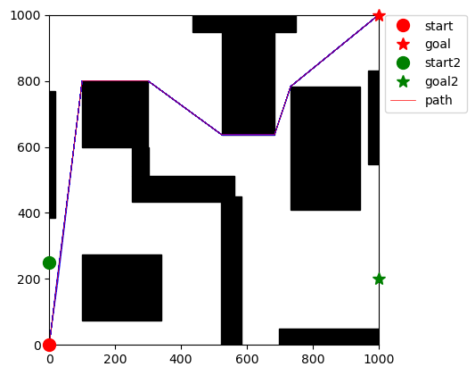
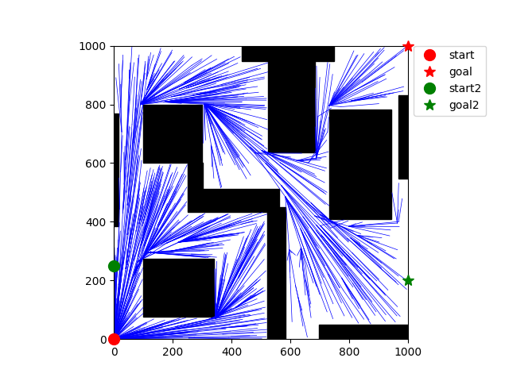

# Path Planning Algorithms (CSC project)

Path planning aims at computing a feasible and efficient trajectory between a start and a goal configuration in a continuous space with obstacles. Unlike graph search, which assumes a discrete set of states, path planning must reason over a continuous domain, making the problem inherently infinite-dimensional and often non-convex.

Such problems arise in many applications, including robotics, autonomous navigation, and motion planning, where environments may be only partially known or too complex to discretize exactly. This motivates the use of sampling-based and optimization-based methods, which can efficiently explore large continuous spaces and provide good-quality solutions without exhaustive enumeration.

In this project we explore two methods for path planning in a fully known 2D environment:
- Particle Swarm Optimization (PSO)
- Rapidly-exploring Random Trees (RRT)


## Example results (scenario 2)

| PSO (example run) | RRT (example run) |
|---|---|
|  |  |


## Repository structure

Main scripts:
- `PSO.py`: single-robot Particle Swarm Optimization
- `RRT.py`: RRT planner
- `PSO_robots.py`: two-robot PSO (robots must avoid obstacles and each other’s safety zone)
- `graph_solve.py`: path-planning solver using Dijkstra for simple environments like the ones provided

Core modules:
- `environment.py`: problem loading + visualization helpers
- `geometry.py`: `Point`, `Rectangle`
- `utils.py`: distances + segment/rectangle intersection helpers
- `scenarios/`: input scenario files (`scenario0.txt`...)
- `animate_robots.py`: animation utility for two-robot trajectories

Figures / outputs:
- `figures/`: RRT-related figures
- `pso_figures/`: PSO-related figures
- (optional) `robots/`: exported robot animations

Report:
- `RRT_report.tex`: project report (includes PSO + RRT sections)

## Scenarios format

Each scenario file contains:
- environment bounds: `xmax ymax`
- robot 1 start/goal: `start1(x,y) goal1(x,y)`
- robot 2 start/goal: `start2(x,y) goal2(x,y)`
- safety radius `R`
- then obstacles as rectangles `(x y width height)` per line (or whitespace-separated)

See `environment.py:load_problem()` for the exact parsing.

## How to run

From the repository root:

### PSO (single robot)

```bash
python PSO.py 0
```
put the number of the scenario instead of 0 to load another scenario

### RRT

```bash
python RRT.py 0
```

### PSO for 2 robots (planning and animation)

```bash
python PSO_robots.py 0
```


## Dependencies

- Python 3.10+ recommended
- `matplotlib`
- `numpy`

Install with:

```bash
pip install matplotlib numpy
```

